# Introductieworkshop Power BI

## Beschrijving

In deze workshop verkennen we *Power BI* - de self-service visualisatietool van Microsoft. 

De diensten en producten die onder Power BI vallen bestaat uit diverse onderdelen:

* Power BI Service - een online plaats waar je datamodellen gedeeld kunnen worden
* Power BI Desktop - een tool voor self-service datamodellering
* Power BI Report Server - een tool om on-premises Power BI-rapporten te hosten.

*In deze workshop kijken we naar Power BI Desktop*.

Power BI Desktop bestaat uit drie componenten:

* Inladen van allerhande bronnen ("ETL")
* Modelleren van data en definiëren van measures
* Weergeven van data en ontwerpen van rapporten

In deze workshop komen alle drie de onderwerpen kort aan bod.

## Programma

Het programma "Power BI Desktop" kun je downloaden vanaf de Windows Store, of vanaf [www.powerbi.com](https://powerbi.microsoft.com/nl-nl/). Wanneer het mogelijk is, installeer Power BI dan vanuit de Windows Store: dit zorgt ervoor dat je automatisch updates e.d. krijgt, en deze niet handmatig hoeft te downloaden. 

Installeer Power BI op je laptop, en start het programma. De eerste keer krijg je het volgende venster te zien:

.

Klik op de link "Already have a Power BI account? Sign in" onderin het venster. Je kunt hier waarschijnlijk inloggen met je Sigma Data-account.

(Het zou kunnen dat Power BI aangeeft dat je je hier voor moet registreren - doe dit dan. Als je dit proces in de browser volledig doorlopen hebt, kun je binnen enkele minuten met je Sigma Data-account inloggen bij Power BI Desktop).

Het scherm ziet er nu als volgt uit:

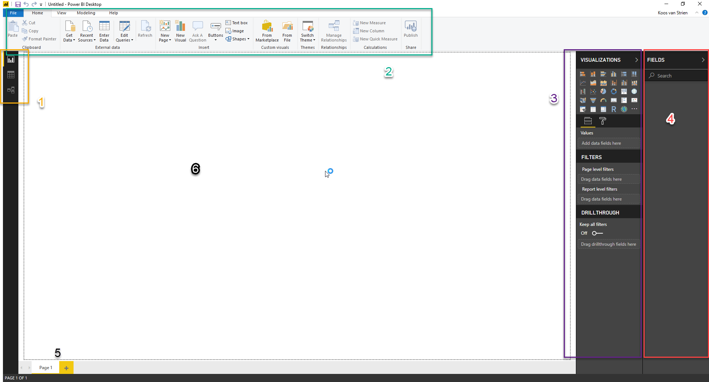

Merk de volgende zaken op:

1. Linksboven zie je drie knoppen, waarmee je tussen *drie weergaven* van je Power BI model kunt schakelen:
   * *Report*
   * *Data*
   * *Relationships*
2. Bovenin zie je een *ribbon* (of "lint"), die net werkt als in Office kent. De lint heeft vijf onderdelen:
   * *File* (menu): Vergelijkbaar met het gelijknamige menu uit Office: opslaan, exporteren, printen en instellingen.
   * *Home*: Hier staan de meeste "basis" zaken die je nodig hebt voor het maken van Power BI-rapportages.
   * *View*: Hier kun je visuele hulpmiddelen aan- en uitzetten, en schakelen tussen de mobiele weergave en de desktop-weergave
   * *Modeling*: Hier staan specifieke zaken voor het inrichten van je datamodel
   * *Help*: Dit is een bijzonder ingewikkeld concept, dat voor nu te ver reikt om uit te leggen ;-).
3. Aan de rechterzijde (paars omlijnd hierboven) zie je het *Visualizations* _pane_. Deze kun je inklappen door op "Visualizations" te klikken (try!). Er zijn drie onderdelen in dit _pane_:
   * *Visualizations*: De verschillende visualisaties die je in een rapport kunt gebruiken
   * *Filters*: filters die van toepassing zijn op het huidige rapport, de huidige pagina, of de huidige visual
   * *Drilltrough*: Bijzondere drillthrough-filters (meer hierover later)
4. Uiterst rechts op het scherm (rood omrand) is het *Fields* _pane). Ook deze kun je inklappen. Hier zie je een lijst van alle tabellen, kolommen en measures die in je datamodel aanwezig zijn
5. Binnen de Report-weergave, zie je onderin de verschillende *pagina's* van een rapport
6. Binnen de Report-weergave is een groot wit vel aanwezig. Hierop kun je je rapport vormgeven. De zwarte stippellijnen geven de randen aan.

## Data inladen

Importeer een CSV-bestand via "Get Data" -> "Text/CSV"

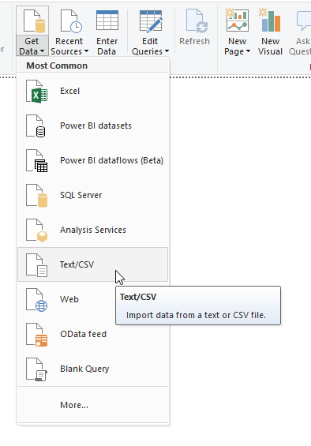

Importeer het bestand ["2014-01.csv"](casus-bestanden/2014-01.csv) uit de map "week-4/casus-bestanden".

### Culture van een CSV-berstand

Afhankelijk van de regio-instellingen van je Windows-installatie (de _culture_) gaat Power BI (net als bijv. Excel) anders met punten en komma's om:

* In Nederland gebruiken we een decimale komma, en een punt als duizendtalscheiding (dus hebben we het over € 1.000,00)
* In de V.S. (waar AdventureWorks zit) wordt een decimale punt gebruikt, en een komma als duizendtalscheiding (dus schrijf je $ 1,000.00)

In het screenshot hieronder zie je een dergelijke "misinterpretatie": de TotalDue van een bepaalde verkoop staat op "263243267":

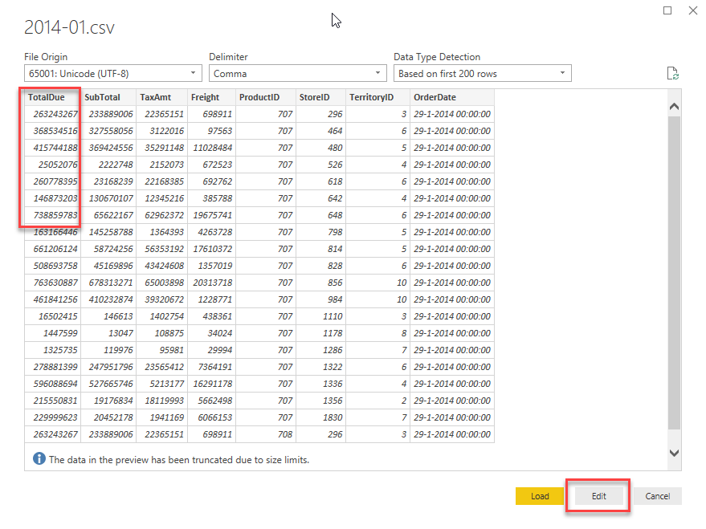

Wanneer je de inhoud van ["2014-01.csv"](casus-bestanden/2014-01.csv) bekijkt, zie je dat dit eigenlijk kommagetal had moeten zijn:

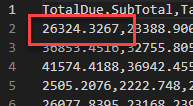

Klik in het preview-venster daarom niet op *Load* maar op *Edit*. Er opent zich nu een nieuw venster - de Power Query Editor.

### Power Query Editor

Power Query is de "ETL" van Power BI: hierin kun je allerhande bestandstypen inladen, en volgens een dataflow inladen.

_Aan de achterzijde van Power Query zit een functionele programmeertaal ("Power Query Language, informally known as M") waarmee je bijzonder krachtig dataflows kunt inrichten om data te laden in je Power BI model. *Je hoeft deze programmeertaal zelden te gebruiken* - veruit de meeste bewerkingen op je data kun je heel goed via de Ribbon doen (of via een rechtsklik op een kolom, waarmee je ook acties te zien krijgt). Eén van de uitzonderingen waar je wél de query taal nodig hebt is bij het inladen van data met een andere _culture_._

Later gaan we dieper in op Power Query - voor nu behandelen we alleen wat er nodig is om Power Query te kunnen gebruiken:

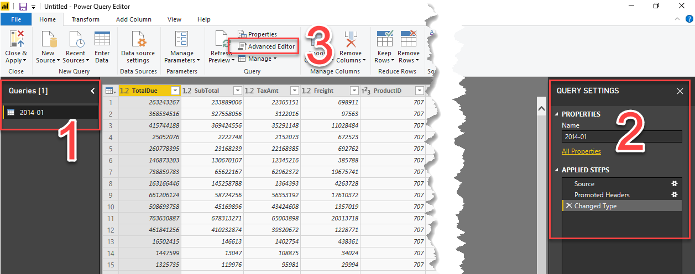

1. Aan de linkerzijde zie je alle *queries*. Elke tabel die in het datamodel van Power BI opgeslagen staat heeft minimaal één query aan de achterzijde. Momenteel zie je dus één query met de naam '2014-01'.
2. Van de geselecteerde query zie je aan de rechterzijde de *query settings*. Hier zie je twee componenten
   * De naam (dus "2014-01")
   * De *Applied steps*. Dit is vergelijkbaar met een dataflow, en heeft een één-op-één relatie met een achterliggend stuk code
3. De *Advanced Editor* geeft toegang tot de code die de dataflow definieert.

* Klik op onder "Applied Steps" achtereenvolgens op "Source", "Promoted Headers" en "Changed Type". In welke stap verdwijnt de decimale punt?
* Open de "Advanced Editor" en bekijk de code. Herken je de stappen uit de dataflow?

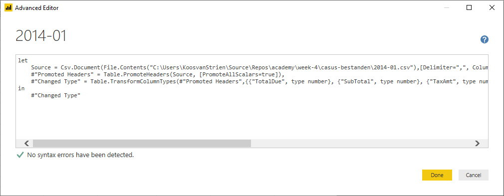

De stap waarin de decimale punt verloren gaat, is de stap met de naam `Changed Type`. Omdat hier een spatie in staat wordt deze in Power Query-taal weergegeven als `#"Changed Type"`. De uitvoer van deze stap is als volgt gedefinieerd:

```OCaml
#"Changed Type" = Table.TransformColumnTypes(#"Promoted Headers",{{"TotalDue", type number}, {"SubTotal", type number}, {"TaxAmt", type number}, {"Freight", type number}, {"ProductID", Int64.Type}, {"StoreID", Int64.Type}, {"TerritoryID", Int64.Type}, {"OrderDate", type datetime}})
```

* In [de documentatie van Power Query language over Table.TransformColumnType](https://docs.microsoft.com/en-us/powerquery-m/table-transformcolumntypes) staat beschreven hoe je de culture aanpast. Doe dit om ervoor te zorgen dat de decimale punten correct worden geïmplementeerd.
* Als de cijfers in TotalDue, SubTotal, TaxAmt en Freight correct worden weergegeven (dus inclusief cijfers achter de komma), klik je op "Close & Apply" linksbovenin het Power Query venster

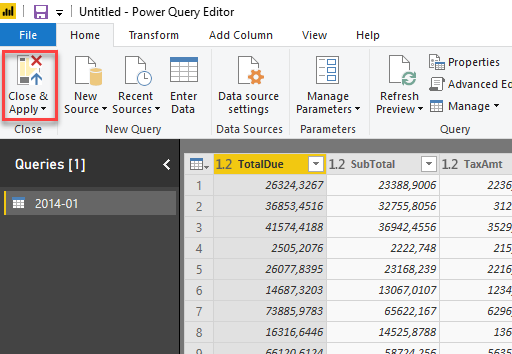

## Eerste visualisatie

Momenteel zit er nog niet heel veel nuttige informatie in het datamodel: er is data van één periode uit 2014 aanwezig, maar alle verwijzingen naar winkels, producten en verkoopgebieden zijn enkel nog technische sleutels.

Maak nu twee Power BI visualisaties:

1. TotalDue per TerritoryID
2. TaxAmt per ProductID

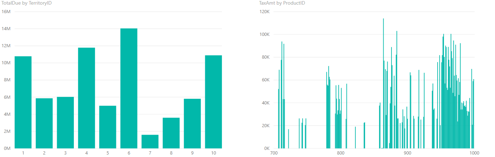

Klik op één van de TerritoryID's op de eerste grafiek. Zoals je ziet verandert de andere grafiek mee.

## Toevoegen van andere bronnen

Om de data nuttiger te maken, gaan we er data uit andere tabellen aan toevoegen. Maak verbinding met de SQL Server-database van Jimmy:

* Adres: 192.152.1.98

Laat de Data Connectivity mode op "Import" staan:

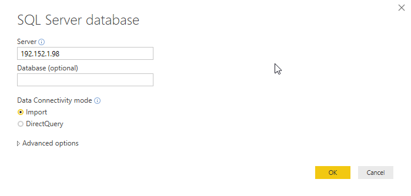

Maak verbinding met de database met "database credentials":

* username:  powerbiuser
* password: PowerBI


Wanneer er een waarschuwing komt over een niet-versleutelde verbinding ("encryption support"), geef hier dan "OK":

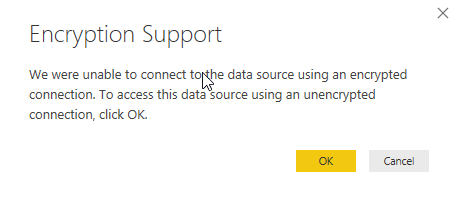

Het venster "Navigator" opent. Klap hier de database "AdventureWorks2016" uit. Je ziet nu eerst een lijst van _views_, daaronder de _tabellen_ en uiteindelijk _table-valued functions_. Selecteer de volgende _tabellen_:

* Person.CountryRegion
* Sales.SalesTerritory
* Production.Product
* Production.ProductSubcategory
* Production.ProductCategory

Je kunt hier de zoekfunctie voor gebruiken:


Klik op "Load" om de data in te laden.

Vervang nu in de rapportage de TerritoryID met de kolom "Name" uit SalesTerritory. Vervang ProductID door de kolom "Name" uit ProductCategory.


Laad nu de tabel "Store" vanuit de Azure SQL Database "AdventureworksLT"

* server: bitrainerpbi.database.windows.net
* database: AW
* username: powerbiuser
* apssword: PowerBI2

Voeg nu in het rapport achtereenvolgens de volgende velden toe:

1. Store -> Name
2. 2014-01 -> Freight


Zoals je ziet wordt voor elke winkel exact hetzelfde bedrag aan vrachtkosten ("freight") weergegeven. Dit is een indicator dat er relaties ontbreken.

## Relaties maken

Om relaties aan te maken, schakel je naar de "Relationships" weergave.

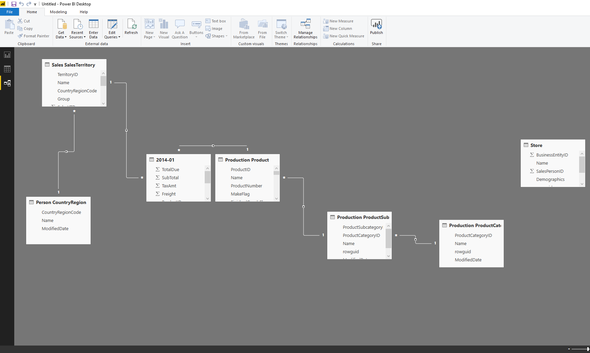

Zoals je ziet, liggen er diverse relaties, weergegeven door lijntjes tussen de tabellen. Wanneer op een relatie klikt, zie je hoe de relatie loopt en welke kolommen naar elkaar refereren. In een relatie zijn drie belangrijke kenmerken:

1. de "1"-zijde
2. de "*"-zijde
3. de filter-richting

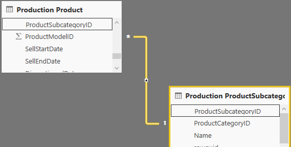

In bovenstaand plaatje:

* De relatie loopt tussen _Production ProductSubcategory_ en _Production Product_
* De relatie ligt aan beide zijden op de kolom _ProductSubcategoryID_
* De kolom _ProductSubcategoryID_ is uniek binnen de tabel _Production Product_ (dit is aangegeven door de "1" bij de relatie)
* Wanneer je de tabel _Production ProductSubcategory_ filtert (door bijvoorbeeld in een rapport te klikken op een subcategorie), dan werkt deze filter door in de lijst met weergegeven producten.

Probeer dit laatste uit in de Report-weergave van Power BI.

Er mist momenteel een relatie tussen de tabel "2014-01" en de tabel "Store". Leg deze aan, door de kolom "BusinessEntityID" te slepen van "Store" en los te laten boven de kolom "StoreID" in de tabel "2014-01":

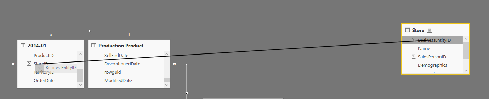

Keer nu terug naar de "report" weergave en verifieer dat de weergave van vrachtkosten per winkel correct gaat.

## Opschonen van je model - en calculated columns

Om het model leesbaarder te houden, kunnen we overbodige kolommen verwijderen of verbergen.

* Bij verwijderen van een kolom wordt deze uit het datamodel verwijderd.
  * De kolom neemt dan geen ruimte meer in.
  * Dit doen we bijvoorbeeld voor niet-gebruikte kolommen die geen relevante betekenis voor ons hebben, of kolommen die bijzonder veel ruimte innemen (zoals XML-data of afbeeldingen)
* Bij verbergen van een kolom is deze standaard onzichtbaar voor een gebruiker.
  * Dit maakt het model meer toegankelijk, maar houdt de kolommen wel beschikbaar.
  * Dit is bijvoorbeeld handig voor ID-kolommen: die hebben geen betekenis.

Voer de volgende zaken uit om het model leesbaarder te maken:

* Hernoem de tabellen
  * Person CountryRegion -> Country-Region
  * Sales SalesTerritory -> Sales Territory
  * Production Product -> Product
  * Production ProductSubcategory -> Product Subcategory
  * Production ProductCategory -> Product Category
* Hernoem de kolommen "Name" in elke tabel, zodat duidelijk is welke naam iets is
  * Bijv. in de tabel "Store" de kolom "Name" -> "Store Name"
* Verberg alle ID-kolommen
* Verwijder kolommen met XML- en GUID-data

### Calculated Columns

In de "Data"-weergave van Power BI kun je eenvoudig bekijken welke data er momenteel in het datamodel zit.

We kunnen hier kolommen toevoegen die gevuld worden op basis van een DAX-expressie. Dit noemen we "Calculated columns".

* Voeg een nieuwe kolom toe aan de tabel "ProductSubcategory" met de naam "Product Category". Vul hier de expressie `=RELATED('ProductCategory'[CategoryName])` in.
* Verberg nu de gehel tabel ProductCategory

Wanneer je nu naar de Report-weergave gaat, zul je zien dat er een tabel minder staat, en de naam van een productcategorie wordt weergegeven onder de tabel Product Subcategory.

* Herhaal bovenstaande stappen om nu de naen van zowel de *productcategorie* als de *productsubcategorie* direct op te nemen in de *Product* tabel. Verberg ook de tabel *Product Subcategory*
