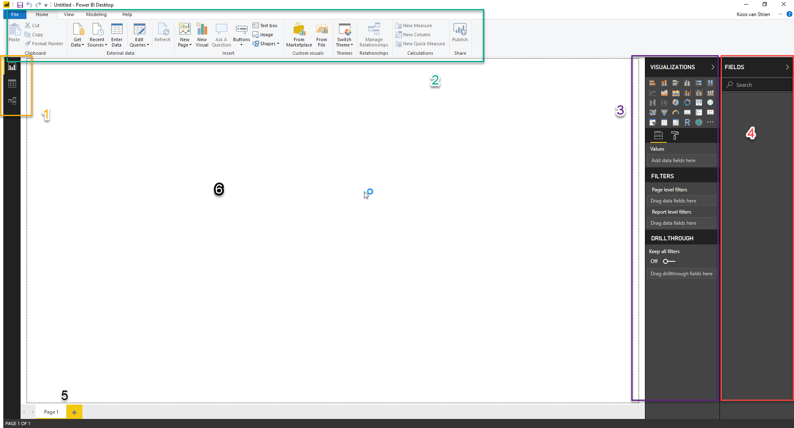

# Introductie Power BI

## Power BI Desktop downloaden

Het programma "Power BI Desktop" kun je downloaden vanaf de Windows Store, of vanaf [www.powerbi.com](https://powerbi.microsoft.com/nl-nl/). Wanneer het mogelijk is, installeer Power BI dan vanuit de Windows Store: dit zorgt ervoor dat je automatisch updates e.d. krijgt, en deze niet handmatig hoeft te downloaden. 

Installeer Power BI op je laptop, en start het programma. De eerste keer krijg je het volgende venster te zien:

.

Klik op de link "Already have a Power BI account? Sign in" onderin het venster. Je kunt hier waarschijnlijk inloggen met je Sigma Data-account.

(Het zou kunnen dat Power BI aangeeft dat je je hier voor moet registreren - doe dit dan. Als je dit proces in de browser volledig doorlopen hebt, kun je binnen enkele minuten met je Sigma Data-account inloggen bij Power BI Desktop).

Het scherm ziet er nu als volgt uit:

Merk de volgende zaken op:

1. Linksboven zie je drie knoppen, waarmee je tussen *drie weergaven* van je Power BI model kunt schakelen:
   * *Report*
   * *Data*
   * *Relationships*
2. Bovenin zie je een *ribbon* (of "lint"), die net werkt als in Office kent. De lint heeft vijf onderdelen:
   * *File* (menu): Vergelijkbaar met het gelijknamige menu uit Office: opslaan, exporteren, printen en instellingen.
   * *Home*: Hier staan de meeste "basis" zaken die je nodig hebt voor het maken van Power BI-rapportages.
   * *View*: Hier kun je visuele hulpmiddelen aan- en uitzetten, en schakelen tussen de mobiele weergave en de desktop-weergave
   * *Modeling*: Hier staan specifieke zaken voor het inrichten van je datamodel
   * *Help*: Dit is een bijzonder ingewikkeld concept, dat voor nu te ver reikt om uit te leggen ;-).
3. Aan de rechterzijde (paars omlijnd hierboven) zie je het *Visualizations* _pane_. Deze kun je inklappen door op "Visualizations" te klikken (try!). Er zijn drie onderdelen in dit _pane_:
   * *Visualizations*: De verschillende visualisaties die je in een rapport kunt gebruiken
   * *Filters*: filters die van toepassing zijn op het huidige rapport, de huidige pagina, of de huidige visual
   * *Drilltrough*: Bijzondere drillthrough-filters (meer hierover later)
4. Uiterst rechts op het scherm (rood omrand) is het *Fields* _pane). Ook deze kun je inklappen. Hier zie je een lijst van alle tabellen, kolommen en measures die in je datamodel aanwezig zijn
5. Binnen de Report-weergave, zie je onderin de verschillende *pagina's* van een rapport
6. Binnen de Report-weergave is een groot wit vel aanwezig. Hierop kun je je rapport vormgeven. De zwarte stippellijnen geven de randen aan.

## Volgende modules

De volgende module is [Module 2: CSV-data inladen, introductie Power Query en eerste visualisatie](02-csv-inladen.md). Hieronder vind je een overzicht van alle modules:

1. *Introductie Power BI Desktop* (huidige module)
2. [CSV-data inladen, introductie Power Query en eerste visualisatie](02-csv-inladen.md)
3. [SQL-bronnen inladen](03-sql-inladen.md)
4. [Relaties leggen](04-relaties.md)
5. [Opschonen en introductie calculated columns](05-opschonen.md)
6. [Meer calculated columns](06-calc-columns.md)
7. [Power Query via de GUI](07-power-query.md)

