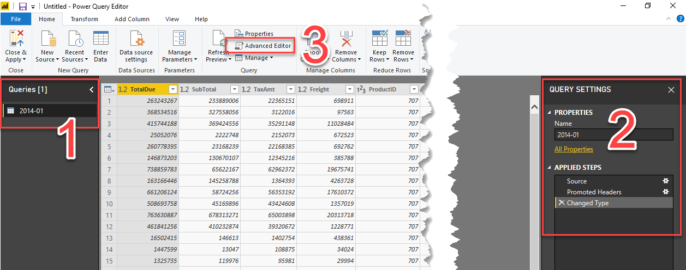

# CSV-data inladen, introductie Power Query en eerste visualisatie 

In deze module laden we CSV-data in. Omdat CSV-data niet bijzonder scherp gedefinieerd is qua inhoud, kun je hier soms tegen uitdagingen aanlopen. We kijken daarom alvast een klein beetje naar Power Query om deze uitdagingen het hoofd te bieden. Ten slotte maken we een eerste visualisatie

## CSV-Data inladen

Importeer een CSV-bestand via "Get Data" -> "Text/CSV"


Importeer het bestand ["2014-01.csv"](casus-bestanden/2014-01.csv) uit de map "week-4/casus-bestanden".

## Culture van een CSV-berstand

Afhankelijk van de regio-instellingen van je Windows-installatie (de _culture_) gaat Power BI (net als bijv. Excel) anders met punten en komma's om:

* In Nederland gebruiken we een decimale komma, en een punt als duizendtalscheiding (dus hebben we het over € 1.000,00)
* In de V.S. (waar AdventureWorks zit) wordt een decimale punt gebruikt, en een komma als duizendtalscheiding (dus schrijf je $ 1,000.00)

In het screenshot hieronder zie je een dergelijke "misinterpretatie": de TotalDue van een bepaalde verkoop staat op "263243267":


Wanneer je de inhoud van ["2014-01.csv"](casus-bestanden/2014-01.csv) bekijkt, zie je dat dit eigenlijk kommagetal had moeten zijn:


Klik in het preview-venster daarom niet op *Load* maar op *Edit*. Er opent zich nu een nieuw venster - de Power Query Editor.

## Power Query Editor

Power Query is de "ETL" van Power BI: hierin kun je allerhande bestandstypen inladen, en volgens een dataflow inladen.

_Aan de achterzijde van Power Query zit een functionele programmeertaal ("Power Query Language, informally known as M") waarmee je bijzonder krachtig dataflows kunt inrichten om data te laden in je Power BI model. *Je hoeft deze programmeertaal zelden te gebruiken* - veruit de meeste bewerkingen op je data kun je heel goed via de Ribbon doen (of via een rechtsklik op een kolom, waarmee je ook acties te zien krijgt). Eén van de uitzonderingen waar je wél de query taal nodig hebt is bij het inladen van data met een andere _culture_._

Later gaan we dieper in op Power Query - voor nu behandelen we alleen wat er nodig is om Power Query te kunnen gebruiken:



1. Aan de linkerzijde zie je alle *queries*. Elke tabel die in het datamodel van Power BI opgeslagen staat heeft minimaal één query aan de achterzijde. Momenteel zie je dus één query met de naam '2014-01'.
2. Van de geselecteerde query zie je aan de rechterzijde de *query settings*. Hier zie je twee componenten
   * De naam (dus "2014-01")
   * De *Applied steps*. Dit is vergelijkbaar met een dataflow, en heeft een één-op-één relatie met een achterliggend stuk code
3. De *Advanced Editor* geeft toegang tot de code die de dataflow definieert.

* Klik op onder "Applied Steps" achtereenvolgens op "Source", "Promoted Headers" en "Changed Type". In welke stap verdwijnt de decimale punt?
* Open de "Advanced Editor" en bekijk de code. Herken je de stappen uit de dataflow?


De stap waarin de decimale punt verloren gaat, is de stap met de naam `Changed Type`. Omdat hier een spatie in staat wordt deze in Power Query-taal weergegeven als `#"Changed Type"`. De uitvoer van deze stap is als volgt gedefinieerd:

```OCaml
#"Changed Type" = Table.TransformColumnTypes(#"Promoted Headers",{{"TotalDue", type number}, {"SubTotal", type number}, {"TaxAmt", type number}, {"Freight", type number}, {"ProductID", Int64.Type}, {"StoreID", Int64.Type}, {"TerritoryID", Int64.Type}, {"OrderDate", type datetime}})
```

* In [de documentatie van Power Query language over Table.TransformColumnType](https://docs.microsoft.com/en-us/powerquery-m/table-transformcolumntypes) staat beschreven hoe je de culture aanpast. Doe dit om ervoor te zorgen dat de decimale punten correct worden geïmplementeerd.
* Als de cijfers in TotalDue, SubTotal, TaxAmt en Freight correct worden weergegeven (dus inclusief cijfers achter de komma), klik je op "Close & Apply" linksbovenin het Power Query venster


## Eerste visualisatie

Momenteel zit er nog niet heel veel nuttige informatie in het datamodel: er is data van één periode uit 2014 aanwezig, maar alle verwijzingen naar winkels, producten en verkoopgebieden zijn enkel nog technische sleutels.

Maak nu twee Power BI visualisaties:

1. TotalDue per TerritoryID
2. TaxAmt per ProductID


Klik op één van de TerritoryID's op de eerste grafiek. Zoals je ziet verandert de andere grafiek mee.


