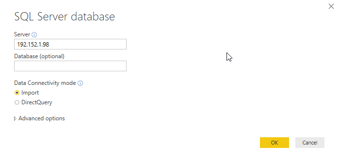
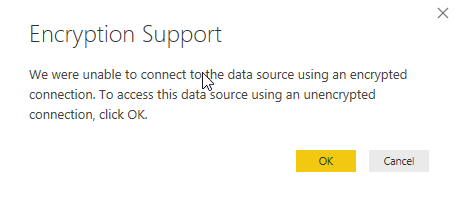

# SQL-bronnen inladen

Om de data nuttiger te maken, gaan we er data uit andere tabellen aan toevoegen. Maak verbinding met de SQL Server-database van Jimmy:

* Adres: 192.152.1.98

Laat de Data Connectivity mode op "Import" staan:

Maak verbinding met de database met "database credentials":

* username:  powerbiuser
* password: PowerBI

Wanneer er een waarschuwing komt over een niet-versleutelde verbinding ("encryption support"), geef hier dan "OK":

Het venster "Navigator" opent. Klap hier de database "AdventureWorks2016" uit. Je ziet nu eerst een lijst van _views_, daaronder de _tabellen_ en uiteindelijk _table-valued functions_. Selecteer de volgende _tabellen_:

* Person.CountryRegion
* Sales.SalesTerritory
* Production.Product
* Production.ProductSubcategory
* Production.ProductCategory

Je kunt hier de zoekfunctie voor gebruiken:

Klik op "Load" om de data in te laden.

Vervang nu in de rapportage de TerritoryID met de kolom "Name" uit SalesTerritory. Vervang ProductID door de kolom "Name" uit ProductCategory.

Laad nu de tabel "Store" vanuit de Azure SQL Database "AdventureworksLT"

* server: bitrainerpbi.database.windows.net
* database: AW
* username: powerbiuser
* apssword: PowerBI2

Voeg nu in het rapport achtereenvolgens de volgende velden toe:

1. Store -> Name
2. 2014-01 -> Freight

Zoals je ziet wordt voor elke winkel exact hetzelfde bedrag aan vrachtkosten ("freight") weergegeven. Dit is een indicator dat er relaties ontbreken.

## Volgende modules

De volgende module is [Module 4: Relaties leggen](04-relaties.md). Hieronder vind je een overzicht van alle modules:

1. [Introductie Power BI Desktop](01-introductie-powerbi-desktop.md)
2. [CSV-data inladen, introductie Power Query en eerste visualisatie](02-csv-inladen.md)
3. *SQL-bronnen inladen* (huidige module)
4. [Relaties leggen](04-relaties.md)
5. [Opschonen en introductie calculated columns](05-opschonen.md)
6. [Meer calculated columns](06-calc-columns.md)
7. [Power Query via de GUI](07-power-query.md)

