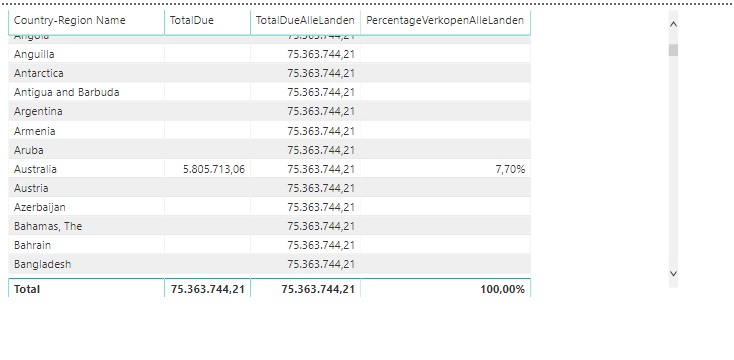
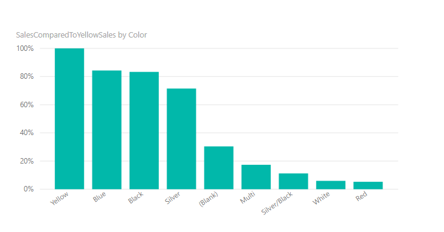
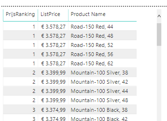
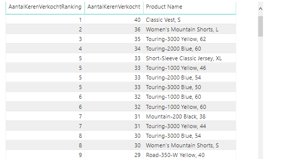
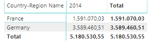

# Extra DAX opdrachten

In de map "Starter" vind je een Power BI bestand genaamd [Start-dag-1.pbix](Starter/Start-dag-1.pbix). Voeg hier de volgende zaken aan toe:

1. Geef een tabel weer met hierin de volgende kolommen (voor kolommen 2 t/m 4 drie aparte measures aanmaken):
   * Landnaam
   * Verkopen ($) in land
   * Verkopen ($) totaal (dus ook buiten een land)
   * Percentage van verkopen binnen een land t.o.v. alle verkopen

2. Geef een grafiek met hierin de verkopen per kleur, geïndexeerd op geel (dus verkopen van gele producten = 100%). Gebruik hier een measure voor

3. Geef de Product-tabel een calculated column met daarin de _ranking_ van prijs (duurste = 1)

4. Geef de Product-tabel een calculated column met hierin hoeveel er van een bepaald product in totaal verkocht is.
   * Het gaat hier dus om het aantal keren verkocht (niet zozeer om het aantal verkochte artikelen of de prijs)
   * Bonus: maak hier ook een _ranking_ kolom bij (meeste verkopen = 1)

5. Maak een matrix waarin wordt weergegeven hoeveel er verkocht is in Duitsland en Frankrijk.
   * Landen op de rijen
   * Jaren op de kolommen (wellicht moet je hier een calculated column voor aanmaken)
   * Gebruik een _measure_ hiervoor
   * Andere landen mogen niet weergegeven worden.

